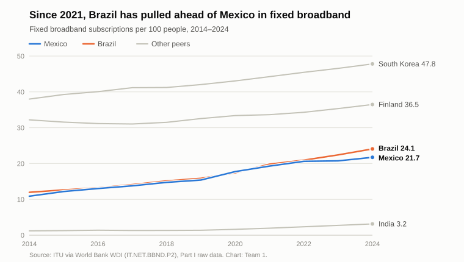
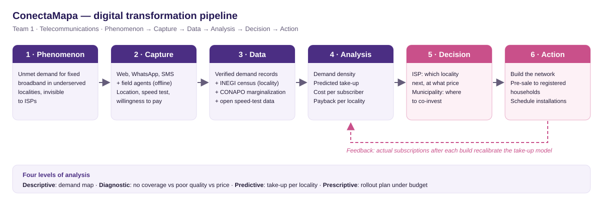

# ConectaMapa — a connectivity demand map for regional ISPs

**Activity 2 · Part II — From Data to Digital Transformation · Team 1 · Sector: Telecommunications**

> Working document (draft for team review). Every section of the Part II brief comes from here. Figures are traceable to [`evidence_log.csv`](evidence_log.csv) (IDs such as `E5`). Numbers marked *illustrative* are hypothetical examples, not observed data.

**Guiding question.** How can an organization turn data and digital capabilities into a concrete decision that produces economic, productive or social value in the telecommunications sector?

**Our answer in one line.** Regional internet service providers (ISPs) in Mexico decide where to extend fixed broadband almost blind to real demand. ConectaMapa lets households and small businesses register unmet demand, turns it into a locality-level demand map, and helps ISPs decide *which locality to connect next and at what price*.

---

## 0. From the Part I diagnosis to this proposal

| Part I finding | Why it matters here |
|---|---|
| Mexico has **21.7 fixed broadband subscriptions per 100 people** (2024), 4th of 5, less than half of South Korea (47.8) — `E1`, `E2` | Fixed broadband is the most concrete connectivity gap and a telecom-specific one |
| In 2014 Mexico and Brazil were almost tied (10.9 vs 12.0). Between 2021 and 2024 Brazil added **+4.3 points** vs Mexico's **+2.4** — `E3` | Brazil is the most useful comparison for fixed broadband |
| In Brazil, small regional providers hold **63.3% of fixed broadband accesses** (end of 2025) — `E9` | Regional ISPs are a documented channel for expanding fixed broadband in hard-to-reach areas. *This is an association, not proof that small ISPs caused Brazil's growth* (see §9). |
| Mexico: 83.1% of people use the internet (2024), 4th of 5 — `E4` | Coverage and use are not the same (Part I §10); the missing households are concentrated in specific places |
| 21.7% of Mexican households (**≈8.6 million**) had no internet at home in 2025. Rural internet use is 75.2% vs 88.9% urban; households with internet range from 90.5% in Mexico City to 53.9% in Chiapas — `E5`–`E8` | **The gap is geographic.** A decision tool has to work at the level of localities, not national averages |

---

## 1. Transformation of the five sectors

Chain: *Technology or digital layer → Data generated → Decision supported*

| Sector | Technology / digital layer | Data generated | Decision supported |
|---|---|---|---|
| **Telecommunications** | Network telemetry and crowdsourced speed tests | Throughput, latency and outages by location and hour; subscribers per area | Where to expand or upgrade network capacity next |
| **Health** | Telemedicine and electronic health records | Consultations, diagnoses, waiting times, referral outcomes | Which rural clinics get specialist tele-consultation slots; which patients are referred first |
| **Agriculture** | Soil-moisture IoT sensors and satellite imagery (vegetation indices) | Soil-moisture time series; crop health per plot | When and how much to irrigate or fertilize each plot |
| **Science** | Shared high-performance / cloud computing and open research-data repositories | Simulation outputs, experimental datasets, compute-usage logs | How to allocate compute time and funding across research projects |
| **Energy** | Smart meters and grid supervisory systems (SCADA) | 15-minute load curves; outage events | Demand forecasting, where to reinforce transformers, time-of-use tariffs |

**Cross-sector insight.** Telecommunications is the *enabling layer* of the other four. Telemedicine, farm sensors, shared research computing and smart meters all need connectivity where the activity happens. Closing a fixed-broadband gap therefore helps other sectors too; this is part of why we chose a telecom problem that sits "upstream".

---

## 2. Definition of the sector problem

**Problem.** Regional ISPs (small fibre or fixed-wireless operators) in Mexico decide where to expand fixed broadband with little information on real demand in underserved localities. The results:
- **viable localities stay unserved** because nobody can see their demand;
- **ISPs take on expansion risk**: they build, and take-up is lower than expected.

| Element | Definition |
|---|---|
| **Phenomenon to observe** | Unmet demand for fixed broadband at the level of a *locality* (INEGI *localidad*): households and small businesses that want a fixed connection, would pay for it, and have no adequate offer |
| **Actor who decides** | The expansion/commercial manager of a regional ISP. Secondary actor: a municipal government deciding where to co-invest (rights of way, poles, public buildings) |
| **Decision** | *Which locality to connect next quarter, and at what monthly price* |
| **Information needed** | Registrations per locality and per 100 households; stated willingness to pay; current service and measured speed; households and electricity per locality (census); distance to the ISP's nearest network node; cost per home connected; historical conversion from registration to paying subscriber |
| **Consequence of the decision** | *Economic:* capex that pays back sooner and fewer failed builds for the ISP. *Social:* households gain a stable connection for school, work and public services. *Productive:* small businesses can sell and get paid online. Potential scale: ≈8.6 million households without internet (`E6`) |

**Why this is not a generic statement.** It names a specific actor (a regional ISP), a specific decision (the next locality and its price), specific data (registrations plus census data) and a measurable outcome (take-up and payback time).

---

## 3. Digital transformation pipeline

`Phenomenon → Capture → Data → Analysis → Decision → Action` (diagram: [`diagrams/pipeline.svg`](diagrams/pipeline.svg))

| Stage | What happens |
|---|---|
| **Phenomenon** | Households and small businesses in underserved localities want a fixed connection, but that demand is invisible to ISPs |
| **Capture** | Registration through a light web page, WhatsApp or SMS, plus offline registration by field agents and community leaders (see §9, representativeness). Each registration records: locality (geolocated), current service, an in-browser speed test, monthly amount they would pay, and main use (school / work / business) |
| **Data** | Geo-referenced demand records, deduplicated and verified (phone code), joined with locality data from INEGI's Population and Housing Census (households, electricity), the CONAPO marginalization index, and open speed-test datasets used as a baseline before the platform has users |
| **Analysis** | Demand density (registrations per 100 households), median willingness to pay, predicted take-up, cost per subscriber and payback time per locality |
| **Decision** | The ISP ranks candidate localities and chooses where to build next and at what price; a municipality chooses where to co-fund |
| **Action** | The ISP builds; registered households are notified and offered pre-sale; installations are scheduled |
| **Feedback loop** | Actual subscriptions after each deployment are fed back to recalibrate the take-up model, so each round of decisions improves on the previous one |

**How the information changes a real decision.** Without ConectaMapa, an ISP typically expands to the largest nearby town or wherever a competitor is absent, based on intuition. With it, a *smaller locality with high registered demand* can move ahead of a larger one with little interest. The ranking changes from "where there are many people" to "where there are many people who will actually subscribe".

---

## 4. Analytical strategy (four levels)

| Level | Question | Data needed | Possible technique | Expected result | Decision supported |
|---|---|---|---|---|---|
| **Descriptive** — *What happened?* | How many households registered unmet demand in each locality last quarter, and what speeds and prices do they report? | Registrations, speed tests, census households per locality | Aggregation, rates per 100 households, geospatial heat maps | Demand map and ranking by demand density | Which localities go on the ISP's shortlist for a field survey |
| **Diagnostic** — *Why did it happen?* | Why do some localities with an existing provider still show high unmet demand? | Speed tests, existing offers and prices, marginalization index, terrain, electricity | Segmentation, comparison of groups, regression with controls | Root cause per locality: **no coverage** vs **poor quality** vs **price too high** | Whether the answer is a new network, a cheaper plan, or an upgrade |
| **Predictive** — *What could happen?* | If the ISP builds in locality X, how many households will subscribe within six months? | Historical conversion (registration → subscription) from past deployments plus locality features | Classification/regression (e.g., logistic regression, gradient boosting) with validation on held-out deployments and uncertainty ranges | Expected take-up and payback time per locality, with a range | Go / no-go for each locality |
| **Prescriptive** — *What should be done?* | With a capex budget B and limited installation crews, which set of localities and prices maximizes subscribers (or net present value) in 12 months? | Predictions above plus build costs, crews and budget | Optimization (knapsack / integer programming) and scenario analysis | Deployment plan and price per locality | Approving the quarterly rollout plan |

**Why a descriptive answer is not a predictive or prescriptive answer.**
- **Descriptive:** a demand map shows *stated interest in the past*.
- **Predictive:** it asks what will happen, and stated interest is not payment. Registrations overstate real take-up (stated vs revealed preference), and the model must learn the conversion rate from past deployments.
- **Prescriptive:** knowing what will happen still does not say what to do, because that depends on constraints (budget, crews) and objectives (profit vs coverage).

Each level needs more data, more assumptions and more validation than the previous one.

---

## 5. From data to action

`Data → Information → Analysis → Finding → Decision → Action`

| Step | In ConectaMapa |
|---|---|
| **Data captured** | One record per household: locality, measured speed, current provider, amount they would pay monthly, main use |
| **Information** | Per locality: registrations per 100 households, median willingness to pay, share with no service vs poor service |
| **Analysis** | Compare expected revenue (predicted take-up × price) with the cost of connecting the locality → payback time |
| **Finding** *(illustrative)* | Locality A has 1,200 households and 96 registrations (8 per 100). Locality B has 450 households and 90 registrations (20 per 100). B has **2.5× the demand density** of A, so its expected cost per subscriber is lower even though it is smaller |
| **Decision** | The ISP moves B ahead of A in its rollout plan, and prices B's plan close to the registered median willingness to pay |
| **Action** | The build starts in B; the 90 registered households get a pre-sale offer; A stays on the map and is reconsidered when its registrations cross a threshold |

---

## 6. Business model

| Dimension | Answer |
|---|---|
| **Value creation** — what problem, for whom? | **Households and small businesses:** a way to make their demand visible and get connected. **Regional ISPs:** validated demand that lowers expansion risk and customer-acquisition cost. **Municipalities:** evidence on where co-investment has the most effect |
| **Value delivery** — how is value received? | Households: free registration via web, WhatsApp or SMS, and a notification when an ISP commits to their locality. ISPs: a dashboard with the demand map, forecasts, and contact with opted-in registrants. Municipalities: periodic aggregated reports |
| **Value capture** — how does ConectaMapa earn? | (1) **SaaS subscription** for ISPs (demand analytics dashboard); (2) **success fee** per registrant who becomes a paying subscriber (marketplace commission); (3) **aggregated, anonymized reports** for municipalities, state digital agencies and infrastructure investors |

**Chosen model: marketplace + SaaS + data-driven, with a free (subsidized) household side.**
- **Why:** the platform subsidizes the price-sensitive side that creates value for the other (households) and charges the side that can pay and benefits directly (ISPs).
- **Models discarded:**
  - e-commerce: we sell no goods;
  - advertising: it would erode trust and conflict with privacy, and a low-income audience has little advertising value;
  - charging households a subscription or freemium tier: it would suppress the very demand signal we need;
  - on-demand: there is no service fulfilled in real time.

---

## 7. Platform and network effects

**Is it a digital platform?** Yes. It is a **multi-sided platform** that connects **households and small businesses (demand)** with **regional ISPs (supply)**, with **municipalities** as a third side (co-funders).

- **Interaction it facilitates:** demand aggregation and matching. Households register → a locality crosses a viability threshold → an ISP commits → households are offered the service and subscribe.
- **Rules needed:**
  - one registration per household, verified by a phone code and location;
  - ISPs must publish price, speed and a deployment date before accessing registrants' contact data;
  - registrants' personal data are shared only with explicit consent and never resold;
  - a speed test after installation, plus ratings of the ISP;
  - penalties for fake demand (for example, an ISP inflating a rival's area).
- **Data generated by interactions:** geo-referenced demand, speed tests, ISP offers, conversion rates, deployment times, quality ratings.

**Network effects.**
- **Indirect (cross-side), positive:** more registered households make the platform more valuable to ISPs; more ISPs mean more competition and coverage, which attracts more households.
- **Direct (same side), positive, for households in the same locality:** each neighbour who registers raises the chance that the locality crosses the viability threshold ("demand pooling"). The value for one household grows with the number of neighbours who join.
- **Direct (same side), negative, for ISPs:** two ISPs competing for the same locality lower each other's value. Rules on exclusivity windows or first-commit priority may be needed.
- **Limit:** the effects are **local** (per locality), not national. That reduces "winner-takes-all" dynamics and forces a locality-by-locality start: seed with a partner ISP and municipal campaigns to overcome the cold-start problem.

---

## 8. Scalability (users grow ten times)

| Area | What happens with 10× users | Cost behaviour |
|---|---|---|
| **Infrastructure / compute** | Registrations are small records; forecasts run in batches per quarter | Grows slowly (cloud, sub-linear) |
| **Storage** | Records and speed tests grow ~10×, but volume stays modest | Grows slowly |
| **Networks** | Web traffic is small; **SMS and WhatsApp messages are paid per message** | Grows linearly with messages |
| **Staff** | Core engineering and data team barely grows; **field agents for offline registration grow with the number of localities** | Mixed: fixed core, variable field work |
| **User acquisition** | The households we most need are the hardest and most expensive to reach (radio, community campaigns); ISPs are acquired through B2B sales | Keeps growing, may even increase per user |
| **Support** | More questions on WhatsApp, including in Indigenous languages in some regions | Grows almost linearly |
| **Regulation** | More personal data → stronger duties under Mexican data-protection law (privacy notices, access/correction/deletion rights, security) | Step increases (audits, compliance staff) |

- **Is it scalable?** The **digital layer is**: matching, analytics and dashboards are software with low marginal cost. But ConectaMapa's value depends on ISPs *physically* building networks, and that does **not** scale like software. The platform is asset-light; the problem it serves is not.
- **Costs that grow slowly:** cloud, software development, model training, dashboards.
- **Costs that keep growing:** messaging, field agents, support, verification against fake demand, B2B sales, compliance.
- **Why scalability ≠ zero cost:** marginal cost is low but never zero (every message, verification and support ticket costs money). Some costs rise in steps (security, legal compliance), and the physical network behind the service has large costs per home connected.

---

## 9. Data quality and responsibility

| Aspect | Possible problem | How it could distort the decision |
|---|---|---|
| **Data quality** | Willingness to pay is self-reported and tends to be inflated; speed tests depend on the device and Wi-Fi; duplicate or fake registrations | Overestimated take-up → the ISP builds where demand is weaker than it looked |
| **Representativeness** | Households **without** internet are the least able to register online, so the map over-represents partially connected households (rural use 75.2% vs urban 88.9% — `E7`) | The platform could **reproduce the digital divide it wants to close**. Mitigation: offline channels (field agents, SMS, community leaders) and weighting against census household counts |
| **Privacy** | Precise home location + phone number + implicit income signals make re-identification possible; the data would be valuable to marketers | Loss of trust → fewer registrations → a weaker signal. Mitigation: explicit consent, locality-level aggregates only until the household opts in, data retention limits, no resale |
| **Bias** | A take-up model trained on past deployments (mostly in denser, wealthier areas) will **under-predict** take-up in poorer or rural localities | The optimizer would systematically deprioritize them, reinforcing the gap. Mitigation: fairness constraints (a minimum share for high-marginalization localities), co-funding, and validating errors by locality type |

**A statistical relationship that could be confused with causation.**
- **Example 1:** localities with more registrations show higher take-up after deployment. That does not prove the platform *caused* the adoption. Both could be driven by higher income, education or community organization. Testing causality would need comparable localities with and without campaigns (e.g., randomized campaign timing or difference-in-differences).
- **Example 2, from Part I:** Brazil's fixed broadband grew faster while its small providers gained share (`E3`, `E9`). That association does not show that small providers *caused* the growth; income, regulation and prices also changed.

---

## 10. Patents and innovation

**WIPO query (mandatory).**
- *Source:* WIPO IP Statistics Data Center, indicator "4a – Patent publications by technology", by applicant's origin, 2014–2024.
- *Fields:* the four closest to our proposal: Telecommunications, Digital communication, Computer technology and IT methods for management.
- *Evidence:* screenshots, data and the exact query are in [`wipo/`](wipo/) (`E12`–`E14`).

| Origin | Publications per year, 2021–2023 avg. | Per million people | Telecom + digital communication per million |
|---|---|---|---|
| South Korea | 54,245 | 1,048.9 | 371.3 |
| Finland | 3,941 | 708.7 | 572.5 |
| India | 5,501 | 3.9 | 1.1 |
| Brazil | 315 | 1.5 | 0.4 |
| **Mexico** | **89** | **0.7** | **0.2** |

- **Mexico is last, and falling.** It has about 89 publications a year in these four fields, 21% fewer than in 2014–2016 (≈113). South Korea publishes about **1,500 times more per person**.
- Finland leads in telecom + digital communication per person, which fits its specialization in network equipment.
- **2024 is left out of the averages** because Brazil, India and Mexico show drops that are most likely incomplete data for the latest year.
- **Implication for ConectaMapa:** Mexico's digital sector does not compete through patents today. Our proposal's advantage would come from **data and network effects** rather than from intellectual property (see Q3 and Q5 below).

1. **What is a patent and what does it protect?** An exclusive right granted by the state over an invention (a product or process that offers a new technical solution to a problem) for a limited period, generally 20 years, in exchange for publicly disclosing how it works. It protects the **technical solution**, not ideas, business models or data as such.
2. **Novelty, inventive activity, industrial application.**
   - *Novelty:* the invention has not been disclosed anywhere before the filing date.
   - *Inventive activity:* it is not obvious to a person skilled in the field.
   - *Industrial application:* it can be produced or used in some industry.

   Mexican law (LFPPI, Art. 48) requires all three (`E11`).
3. **Could any component be inventive?** The **business model** (a demand-aggregation marketplace) is **not** patentable. Mexican law excludes business methods and computer programs *as such* (LFPPI, Art. 47 — `E11`). A *possible* inventive component would be a **technical method** that combines crowdsourced speed measurements, geospatial census data and network-design parameters to estimate the cost and viability of connecting a locality. Even that might fail the inventive-activity test if examiners judge it an obvious combination of known techniques.
4. **Main technology area.**
   - The platform itself: **computer technology** (analytics, data processing; in WIPO's classification, close to "IT methods for management").
   - What it helps deploy: **telecommunications / digital communication** (the fixed networks, and the speed-measurement component).
5. **Are several patents proof of high innovation, adoption or economic success?** No.
   - Patents count *invention attempts* (applications), not quality or use.
   - Many patents are never commercialized; others are filed defensively or strategically.
   - The propensity to patent varies by sector and country.
   - Adoption and success must be measured with other evidence: subscribers, revenue, market share.

   This connects to Part I: resident patents were one of Mexico's weakest indicators, and that alone did not describe its digital capabilities.

---

## 11. Digital does not mean immaterial

**Physical elements needed:**
1. Household devices (smartphones or computers) to register and run speed tests.
2. Servers in data centres, with cooling, to host the platform.
3. The ISP's physical network: fibre-optic cable, poles or trenches, optical line terminals and home terminals (or fixed-wireless radios and towers).
4. Electricity, including backup power, for all network equipment.

- **Material cost:** fibre per kilometre plus equipment per home. ConectaMapa cannot reduce that cost; it only helps spend it where take-up is higher.
- **Energy cost:** network equipment (terminals, radios, towers) consumes electricity 24/7. In rural localities with an unreliable grid this requires batteries, solar panels or diesel generators. The platform's own cloud consumption is small by comparison.
- **Environmental externality:** electronic waste from routers and terminals replaced every few years; emissions from diesel backup; land disturbance from trenching.

---

## 12. Artificial intelligence and energy

**The energy system in both directions: Mexico's national electricity grid.** It is the same grid that powers the rural networks ConectaMapa helps deploy.

| Direction | Mechanism | Example |
|---|---|---|
| **AI can improve the grid** | Machine-learning forecasts of electricity demand and of solar and wind output let the grid operator schedule generation and reserves more precisely, integrate more renewables and detect failures earlier. On the demand side, large loads can adapt to forecasts | (a) A grid operator such as CENACE (Mexico's national energy control centre) could use AI forecasts of next-day demand and solar output to keep fewer fossil plants running as reserve. (b) Close to our project: ISPs connected to the same grid use traffic forecasts to put idle radio equipment into sleep mode at night, which cuts their load on the grid and their backup-battery needs |
| **AI growth raises demands on the same grid** | AI data centres add large loads that run 24/7, plus cooling, and require new generation and transmission capacity | The IEA estimates that a typical AI-focused data centre uses as much electricity as 100,000 households, and the largest under construction 20 times as much (`E15`). Global data-centre use was ~415 TWh in 2024 and is projected to reach ~945 TWh by 2030 (`E10`). A new AI data centre connected to Mexico's grid competes for the same generation and transmission capacity that rural localities, and the ISP networks we help build, depend on. In our own design we avoid adding to that load: registration uses a simple form, not a large language-model chatbot |

---

## 13. Final proposal

| Element | Guiding question | ConectaMapa |
|---|---|---|
| **Problem** | What situation are we trying to solve? | Regional ISPs expand fixed broadband without seeing real demand; viable underserved localities stay unconnected |
| **Evidence** | What data show the problem is relevant? | 21.7 fixed subscriptions per 100 people (4th of 5; `E1`–`E2`); slower growth than Brazil since 2021 (`E3`); ≈8.6 million households without internet (`E6`); strong geographic gaps (`E7`–`E8`); in Brazil, regional ISPs hold 63.3% of fixed broadband (`E9`) |
| **Strategy** | How would data be obtained and analyzed? | Online and offline registration, joined with census and speed data; four levels of analysis, ending with an optimization of the rollout plan (§3–§5) |
| **Decision** | What decision could be improved? | Which locality the ISP connects next, and at what price; where municipalities co-invest |
| **Value** | Who benefits? | Households and small businesses (connection), ISPs (lower risk, cheaper acquisition), municipalities (evidence for investment) |
| **Business model** | How could it be sustained? | Free for households; SaaS + success fee for ISPs; aggregated reports for the public sector (§6) |
| **Limitations** | What could make it fail? | ISPs lacking capital even when demand exists; permits and rights of way; fake or inflated demand; the cold start; localities that are never viable without subsidy; dependence on ISP participation; privacy incidents; regulatory changes |

---

## Sources

See [`evidence_log.csv`](evidence_log.csv) for values, periods and access dates.
- Part I dataset: ITU indicators via the World Bank WDI API (`../data/raw/`).
- INEGI, *ENDUTIH 2025 — Reporte de Resultados 19/26* (16 June 2026).
- Anatel, *Relatório de Monitoramento da Competição — 4T2025*.
- IEA, *Energy and AI* (2025).
- *Ley Federal de Protección a la Propiedad Industrial* (Mexico, 2020), Arts. 47–48.
- WIPO IP Statistics Data Center, *4a – Patent publications by technology* (database updated May 2026; consulted 29 September 2026) — evidence in [`wipo/`](wipo/).
- World Bank WDI, population (`SP.POP.TOTL`), used for per-million figures.
